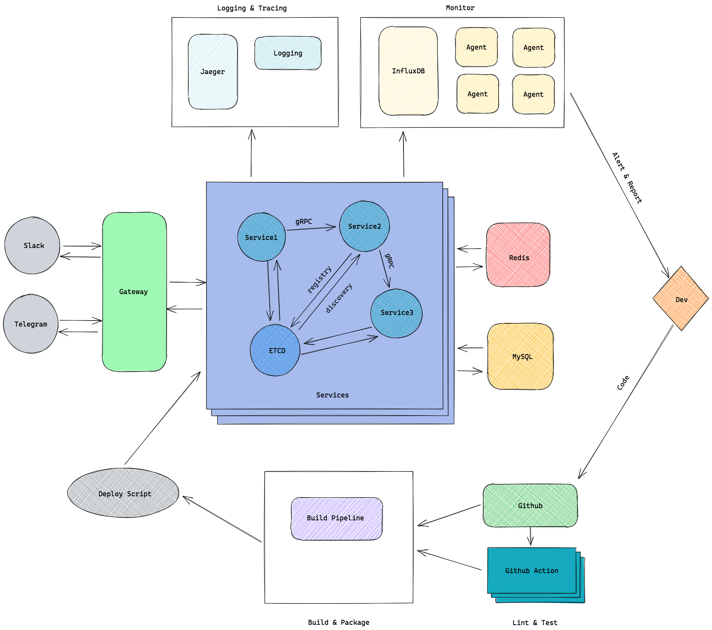

# Assistant Bot


[](https://codecov.io/gh/tsundata/assistant)
[](https://goreportcard.com/report/github.com/tsundata/assistant)


Assistant Bot is a workflow engine for chatbot

## Features

- Chat bot
- Message Publish/Subscribe Hub
- Message Cron, Trigger, Task, Pipeline
- Workflow Action ([Syntax](./docs/syntax.md))

## Architecture

 

## Applications used

- etcd
- influx
- jaeger
- mysql
- rabbitmq
- redis

## Requirements

This project requires Go 1.17 or newer

## Installation

1. Install MySQL, Redis, influx, jaeger, rabbitmq, etcd

2. Import Configuration to etcd

3. Database migrate

4. Set Environment

   See [docs/env.md](/docs/env.md)

5. Build binary
   ```
   task build
   ```

6. Run App binary

# License

Assistant Bot is licensed under the [MIT license](https://opensource.org/licenses/MIT).
